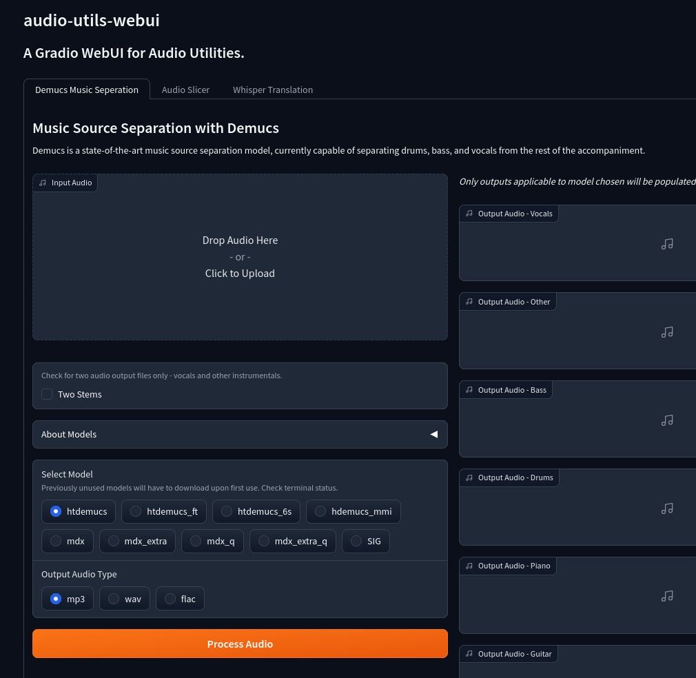

#  audio-utils-webui - A Gradio WebUI for audio utilities.



### Current audio utilities included in WebUI
- [Demucs](https://github.com/facebookresearch/demucs)
- [OpenAI Whisper](https://github.com/openai/whisper)
- [Audio Slicer](https://github.com/openvpi/audio-slicer)

## Features

- Separates audio tracks into different stems like vocals, instrumental, drums, bass using demucs models.
- Split audio files based on silence detection using audio slicer.
- Translate audio speech to text using OpenAI's Whisper models.
- Run locally on your own hardware.
- Supports various audio types including MP3, WAV, and FLAC.
- Provides a simple and intuitive web UI for easy use.

### Pending maybe future utilities
- Other denoise deecho dereverb utilities
- WebUI for helpful FFMpeg commands concate audio files etc.

## FFmpeg Requirement
- **FFmpeg** must be installed for your OS. Refer to [FFMPEG official site](https://ffmpeg.org/download.html).

```terminal
# Debian based Linux installation of FFmpeg is simple
sudo apt -y install ffmpeg
```
```terminal
# Windows install, you will need to download and extract the latest release.
# Add extracted directory to PATH so ffmpeg binaries can be access by the application.
Direct link to download https://www.gyan.dev/ffmpeg/builds/ffmpeg-git-full.7z

# Windows adding to path
# Open cmd terminal as administrator and run the following command (example assumes binaries are extracted to c:\ffmpeg)
setx /m PATH "C:\ffmpeg\bin;%PATH%"
```
```terminal
# MacOS
# homebrew install will be the easiest if installed, otherwise refer to official FFMPEG install guides.
brew install ffmpeg
```

## Python Environment Setup and WebUI Installation

Before running the program, ensure you have the necessary Python packages installed. Using a virtual environment. Example below uses Conda.

### Linux, Windows or MacOS
```terminal
# Using a miniconda virtual environment

conda create -y -n demucs python=3.10.9
conda activate demucs
```
```terminal
# Install Python requirements with pip
pip install demucs gradio soundfile
# Pip install latest version of Whisper
pip install git+https://github.com/openai/whisper.git
```
Next, clone the repository and navigate to the project directory:

```terminal
git clone https://github.com/bradsec/audio-utils-webui.git
cd audio-utils-webui
```

## Usage

To start the program, run the following command in the project directory:

```terminal
python webui.py
```

This will launch the Gradio WebUI on `http://0.0.0.0:7860`. Open this URL in a web browser to access the user interface. If launching on the same PC you can use `http://localhost:7860`, otherwise `0.0.0.0` allows it to accessed from any computer on the local network using the assigned IP address of machine hosting the webui ie. `http://192.168.0.1:7860`.

**Note:** On first use of demucs and whisper will download the required checkpoints and models. Check the terminal output for status of the download and processing etc.

## Testing
- September 2023 - Tested above install and webui usage on Debian 12 (Bookworm) and Microsoft Windows 11.

## Limitations
- May be issues with very long audio files.

## Troubleshooting

Check terminal output for information. All commands and progress will be shown in terminal. As mentioned, models need to download on first use, the number of files and their size may vary. Other messages such as out of memory (GPU) will also be shown in the terminal.

## Licence Information / Credit
- MIT Licence - [audio-utils-webui github.com/bradsec/audio-utils-webui](https://github.com/bradsec/audio-utils-webui)
- Apache-2.0 License - [Gradio github.com/gradio-app/gradio](https://github.com/gradio-app/gradio)
- MIT Licence - [Demucs - github.com/facebookresearch/demucs](https://github.com/facebookresearch/demucs)
- MIT Licence - [Audio Slicer - github.com/openvpi/audio-slicer](https://github.com/openvpi/audio-slicer)
- MIT Licence - [OpenAI Whisper - github.com/openai/whisper](https://github.com/openai/whisper)  
- [Mixed Licence](https://github.com/FFmpeg/FFmpeg/blob/master/LICENSE.md) - [github.com/FFmpeg/FFmpeg](https://github.com/FFmpeg/FFmpeg)